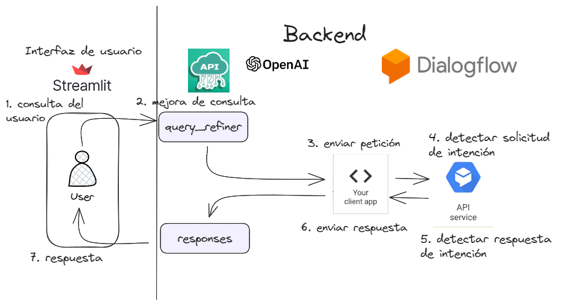

# BERTALANFFY.AI
Este es un prototipo realizado por estudiantes de la Facultad de Ingeniería Industrial y de Sistemas que están cursando el segundo ciclo de la carrera.
## Objetivo
Este proyecto tiene un carácter académico. 
El objetivo general es complementar la forma de estudio de los estudiantes que estén llevando el curso Teoría y Ciencia de Sistemas, proporcionándoles una herramienta adicional para sus estudios.


## Tecnologías
* Dialogflow ES
    > [crearse una cuenta aquí](https://cloud.google.com/dialogflow?utm_source=google&utm_medium=cpc&utm_campaign=latam-PE-all-es-dr-SKWS-all-all-trial-b-dr-1605194-LUAC0020100&utm_content=text-ad-none-any-DEV_c-CRE_649144238397-ADGP_Hybrid%20%7C%20SKWS%20-%20BRO%20%7C%20Txt%20~%20AI%20&%20ML_Dialogflow-KWID_43700075321244147-kwd-566031983912&utm_term=KW_dialogflow-ST_Dialogflow&gclid=CjwKCAjw5MOlBhBTEiwAAJ8e1p2p2Lz-OdD4_P4u2vqNkKSp9c49_ZkhQMsy9Ecc5oMUrj1NUTkhphoCAXwQAvD_BwE&gclsrc=aw.ds&hl=es-419)
* Cuenta de OpenAI
    > [crearse una cuenta aquí ](https://openai.com/)
* API key de OpenAI
    > [obtener tu api key aquí](https://platform.openai.com/)
* NGROK(opcional), sirve para exponer tu servidor local a internet
    > Puedes encontrar más información en su página web: [Ngrok](https://ngrok.com/)
* Python como herramienta para programar
    > Puedes encontrar una guía de la documentación oficial de Python aquí: [Documentación oficial de Python](https://docs.python.org/3/)
* Streamlit, Framework utilizado para la interfaz de usuario.
    > Puedes encontrar una guía de la documentación oficial de Streamlit [Documentación oficial de Streamlit](https://docs.streamlit.io/)
## Arquitectura 

## Instalación y dependencias
1. Clona el repositorio. Ejemplo:
```
git clone [github https url]
```
2. Crea tu entorno virtual. Ejemplo para windows:
```
python -m venv [nombre de tu carpeta]
```
3. Activa tu entorno virtual. Ejemplo para windows:
- Visual studio code con Windows
```
nombre_del_entorno\Scripts\activate
```
- Linux
```
source nombre_del_entorno/bin/activate
```
Ojo: Si usas pycharm, solo activa tu entorno  en tu configuración
4. Configura tu archivo `.env`

- Crea tu archivo `.env` y agrega tus credenciales
   Tu archivo `.env` debería verse así:

```
OPENAI_API_KEY="your API key"
DIALOGFLOW_PROJECT_ID = "your id project"

```
5. Instala las dependencias
```
pip install -r requirement.txt
```
6. Correr el programa (puedes cambiar el nombre del archivo main)
```
streamlit run main.py
```
7. Si deseas compartir tu proyecto desde tu servidor local, puedes copiar este codigo:
 - Windows powershell
```
.\ngrok http 8501
```
 - Linux
```
ngrok http 8501
```
Nota: El modelo esta orientado a respondes solo preguntas de los test semanales, exceptuando los ensayos. 
## Comunicación y colaboración
Estamos abiertos a la comunicación y deseamos trabajar contigo en el desarrollo del Prototipo2. 
Si tienes alguna pregunta, idea o sugerencia, no dudes en contactarnos a través de [nuestro correo](mailto:jefrypro071203@gmail.com).
